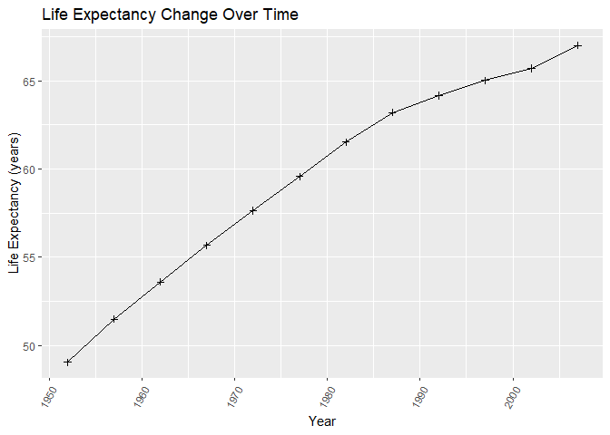
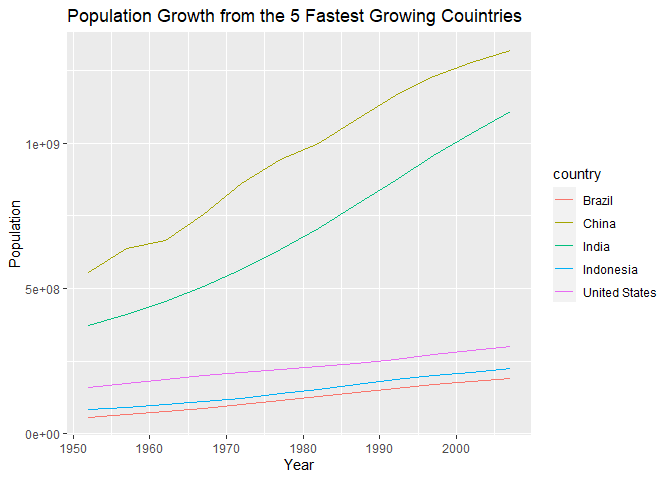

```r
#install.packages("gapminder")
library("gapminder")
```

```
## Warning: package 'gapminder' was built under R version 4.1.3
```

## Instructions
Answer the following questions and complete the exercises in RMarkdown. Please embed all of your code and push your final work to your repository. Your final lab report should be organized, clean, and run free from errors. Remember, you must remove the `#` for the included code chunks to run. Be sure to add your name to the author header above. For any included plots, make sure they are clearly labeled. You are free to use any plot type that you feel best communicates the results of your analysis.  

**In this homework, you should make use of the aesthetics you have learned. It's OK to be flashy!**

Make sure to use the formatting conventions of RMarkdown to make your report neat and clean!  

## Load the libraries

```r
library(tidyverse)
library(janitor)
library(here)
library(naniar)
```


## Resources
The idea for this assignment came from [Rebecca Barter's](http://www.rebeccabarter.com/blog/2017-11-17-ggplot2_tutorial/) ggplot tutorial so if you get stuck this is a good place to have a look.  

## Gapminder
For this assignment, we are going to use the dataset [gapminder](https://cran.r-project.org/web/packages/gapminder/index.html). Gapminder includes information about economics, population, and life expectancy from countries all over the world. You will need to install it before use. This is the same data that we will use for midterm 2 so this is good practice.


## Questions
The questions below are open-ended and have many possible solutions. Your approach should, where appropriate, include numerical summaries and visuals. Be creative; assume you are building an analysis that you would ultimately present to an audience of stakeholders. Feel free to try out different `geoms` if they more clearly present your results.  

**1. Use the function(s) of your choice to get an idea of the overall structure of the data frame, including its dimensions, column names, variable classes, etc. As part of this, determine how NA's are treated in the data.**  

```r
summary(gapminder)
```

```
##         country        continent        year         lifeExp     
##  Afghanistan:  12   Africa  :624   Min.   :1952   Min.   :23.60  
##  Albania    :  12   Americas:300   1st Qu.:1966   1st Qu.:48.20  
##  Algeria    :  12   Asia    :396   Median :1980   Median :60.71  
##  Angola     :  12   Europe  :360   Mean   :1980   Mean   :59.47  
##  Argentina  :  12   Oceania : 24   3rd Qu.:1993   3rd Qu.:70.85  
##  Australia  :  12                  Max.   :2007   Max.   :82.60  
##  (Other)    :1632                                                
##       pop              gdpPercap       
##  Min.   :6.001e+04   Min.   :   241.2  
##  1st Qu.:2.794e+06   1st Qu.:  1202.1  
##  Median :7.024e+06   Median :  3531.8  
##  Mean   :2.960e+07   Mean   :  7215.3  
##  3rd Qu.:1.959e+07   3rd Qu.:  9325.5  
##  Max.   :1.319e+09   Max.   :113523.1  
## 
```

```r
dim(gapminder)
```

```
## [1] 1704    6
```

```r
naniar::miss_var_summary(gapminder)
```

```
## # A tibble: 6 x 3
##   variable  n_miss pct_miss
##   <chr>      <int>    <dbl>
## 1 country        0        0
## 2 continent      0        0
## 3 year           0        0
## 4 lifeExp        0        0
## 5 pop            0        0
## 6 gdpPercap      0        0
```
#From this we know that the NAs are not represented by the typical NA. Basedf on a looktrhough the data and the summary function it would appear that there are very little NAs. Maybe the )other) distinction is the NA?

```r
gapminder
```

```
## # A tibble: 1,704 x 6
##    country     continent  year lifeExp      pop gdpPercap
##    <fct>       <fct>     <int>   <dbl>    <int>     <dbl>
##  1 Afghanistan Asia       1952    28.8  8425333      779.
##  2 Afghanistan Asia       1957    30.3  9240934      821.
##  3 Afghanistan Asia       1962    32.0 10267083      853.
##  4 Afghanistan Asia       1967    34.0 11537966      836.
##  5 Afghanistan Asia       1972    36.1 13079460      740.
##  6 Afghanistan Asia       1977    38.4 14880372      786.
##  7 Afghanistan Asia       1982    39.9 12881816      978.
##  8 Afghanistan Asia       1987    40.8 13867957      852.
##  9 Afghanistan Asia       1992    41.7 16317921      649.
## 10 Afghanistan Asia       1997    41.8 22227415      635.
## # ... with 1,694 more rows
```


**2. Among the interesting variables in gapminder is life expectancy. How has global life expectancy changed between 1952 and 2007?**

```r
p1 <- gapminder %>% 
  group_by(year) %>% 
   summarize(mean=mean(lifeExp))
p1
```

```
## # A tibble: 12 x 2
##     year  mean
##    <int> <dbl>
##  1  1952  49.1
##  2  1957  51.5
##  3  1962  53.6
##  4  1967  55.7
##  5  1972  57.6
##  6  1977  59.6
##  7  1982  61.5
##  8  1987  63.2
##  9  1992  64.2
## 10  1997  65.0
## 11  2002  65.7
## 12  2007  67.0
```


```r
gapminder %>% 
  group_by(year) %>% 
   summarize(mean=mean(lifeExp))%>% 
  ggplot(aes(x=year, y= mean))+
  geom_line()+
  geom_point(shape=3)+
  theme(axis.text.x = element_text(angle = 60, hjust = 1))+
  labs(title = "Life Expectancy Change Over Time",
       x = "Year",
       y = "Life Expectancy (years)")
```

<!-- -->
group_by(year, lifeExp) %>% 
   summarize(mean=mean(lifeExp))%>% 
**3. How do the distributions of life expectancy compare for the years 1952 and 2007?**

```r
gapminder %>% 
  filter(year == 1952| year == 2007) %>% 
    mutate(year=as.factor(year)) %>% 
  ggplot(aes(x=lifeExp, group=year, fill=year))+
  geom_density(alpha  =0.4, color = "black")+
  labs(title = "Distrubition of Life Expectancy")
```

<!-- -->

**4. Your answer above doesn't tell the whole story since life expectancy varies by region. Make a summary that shows the min, mean, and max life expectancy by continent for all years represented in the data.**

```r
gapminder %>% 
  group_by(country) %>% 
  summarize(min_life =min(lifeExp),
            max_life=max(lifeExp),
           mean_life=mean(lifeExp))
```

```
## # A tibble: 142 x 4
##    country     min_life max_life mean_life
##    <fct>          <dbl>    <dbl>     <dbl>
##  1 Afghanistan     28.8     43.8      37.5
##  2 Albania         55.2     76.4      68.4
##  3 Algeria         43.1     72.3      59.0
##  4 Angola          30.0     42.7      37.9
##  5 Argentina       62.5     75.3      69.1
##  6 Australia       69.1     81.2      74.7
##  7 Austria         66.8     79.8      73.1
##  8 Bahrain         50.9     75.6      65.6
##  9 Bangladesh      37.5     64.1      49.8
## 10 Belgium         68       79.4      73.6
## # ... with 132 more rows
```

**5. How has life expectancy changed between 1952-2007 for each continent?**

```r
gapminder %>% 
  group_by(year, continent) %>% 
   summarize(mean=mean(lifeExp))%>% 
  ggplot(aes(x=year, y= mean, group=continent, color=continent))+
  geom_line()+
  geom_point(shape=3)+
  theme(axis.text.x = element_text(angle = 60, hjust = 1))+
  labs(title = "Change Over Time of Life Expectancies Around the World",
       x = "Year",
       y = "Life Expectancy (years)")
```

```
## `summarise()` has grouped output by 'year'. You can override using the
## `.groups` argument.
```

<!-- -->


**6. We are interested in the relationship between per capita GDP and life expectancy; i.e. does having more money help you live longer?**

```r
gapminder%>% 
  ggplot(aes(x=gdpPercap, y=lifeExp))+ 
  geom_point(na.rm=T)+
  geom_point()+
  geom_smooth(method = lm, se=F)+
  labs(title = "Effect of Money on Life Expectancy", x="per Capita GDP", y="Life Expectancy (years)")+
  theme(plot.title = element_text(size=rel(1.25), hjust=1))
```

```
## `geom_smooth()` using formula 'y ~ x'
```

<!-- -->

**7. Which countries have had the largest population growth since 1952?**

```r
gapminder %>% 
  select(year, country, pop) %>% 
  filter(year == 1952 | year == 2007) %>% 
  pivot_wider(names_from = year, values_from = pop) %>% 
  mutate(difference = `2007`-`1952`) %>% 
  arrange(desc(difference))
```

```
## # A tibble: 142 x 4
##    country          `1952`     `2007` difference
##    <fct>             <int>      <int>      <int>
##  1 China         556263527 1318683096  762419569
##  2 India         372000000 1110396331  738396331
##  3 United States 157553000  301139947  143586947
##  4 Indonesia      82052000  223547000  141495000
##  5 Brazil         56602560  190010647  133408087
##  6 Pakistan       41346560  169270617  127924057
##  7 Bangladesh     46886859  150448339  103561480
##  8 Nigeria        33119096  135031164  101912068
##  9 Mexico         30144317  108700891   78556574
## 10 Philippines    22438691   91077287   68638596
## # ... with 132 more rows
```

**8. Use your results from the question above to plot population growth for the top five countries since 1952.**

```r
gapminder %>% 
  filter(country=="China" | country=="India" | country=="United States" | country=="Indonesia" | country=="Brazil") %>% 
  select(year, pop, country) %>% 
  ggplot(aes(x=year, y=pop, color=country))+
  geom_line()+ 
  labs(title = "Population Growth from the 5 Fastest Growing Couintries",
       x = "Year",
       y = "Population")
```

<!-- -->

**9. How does per-capita GDP growth compare between these same five countries?**

```r
gapminder %>% 
  filter(country == "China" | country == "India" | country == "United States" | country == "Indonesia" | country == "Brazil") %>% 
  group_by(year, country) %>% 
  ggplot(aes(x=year, y= gdpPercap, group=country, color= country))+
  geom_line()+
  geom_point(shape=2)+
  labs(title = "GDP Growth for the Highest Population Growth Countries",
       x = "Year",
       y = "GDP")
```

<!-- -->
## ANSWER TO QUESTION 10. For some reason every code chunk that I put under the question 10 did not have the little run button. Must be some sort of glitch. (**10. Make one plot of your choice that uses faceting!**)


```r
gapminder %>% 
  filter(country == "China" | country == "India" | country == "United States" | country == "Indonesia" | country == "Brazil") %>% 
  ggplot(aes(x=lifeExp, y=pop, fill=country))+ 
  geom_point(alpha=0.6) + 
    geom_smooth(method=lm, se=T)+
  facet_wrap(~year, ncol=4)+
  theme(axis.text.x = element_text(angle = 50, hjust = 2))+
  labs(title = "Population vs Life Expectancy Per country",
       x = NULL,
       y = "Population",
       fill = "country")
```

```
## `geom_smooth()` using formula 'y ~ x'
```

<!-- -->
## Whenever I run the code above it just keeps loading and does not produce a plot. Will ask about it in class. 
## Push your final code to GitHub!
Please be sure that you check the `keep md` file in the knit preferences. 
